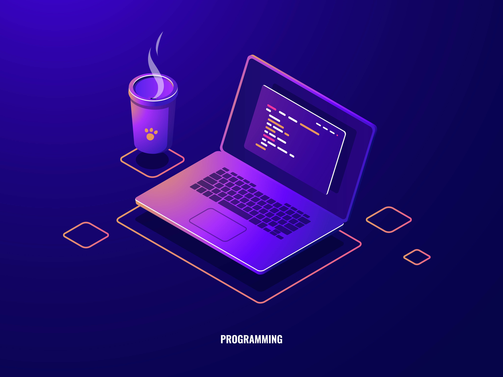

## Hello there, I'm Rishabh Saudagar  - aka [WhiteHorse101] 👋

<h2> I'm a Frontend Developer and Student!!</h2>

- 🔨 I'm Working on Web Devlopment  
- 👯 I’m looking to collaborate with other content creators and Developers
- 🎯 2021 Goals: Contribute more to Open Source projects and learn MongoDb
- ⚡ Trying Hard on Web Development and Android app Development.
- 📫 How to reach me: rishabh.saudagar2001@gmail.com

 <h2> Connect with me:
</h2>
 <!-- [][codechef]
[][leetcode]  -->

<!-- [][linkedin] -->

<!-- [][website]

<!-- [][twitter] -->

<!-- [][instagram] -->
<!-- [][gmail] -->

<h2> Languages and Tools: </h2>

 
 

 

 

 

 

 

 
<!--   -->

<!-- 
 -->

  

  
  
<!--   -->
 
<!--  -->

 
 
 
<!--   -->

<!--  -->

<!--  -->
<!--  

  
  

  

 -->

 

<!-- 
<h2> Upcoming Things!!! </h2>
<!-- --- -->
<!-- <strong>Well Commented with Propper Logical Solution</strong> of Every Comepetitive programming Contests on  <u>Codechef ,  CodeForces and Leetcode </u>  will be Uploaded here! --> 
<!-- ### 📺 Latest YouTube Videos -->

<!-- 
- [Top VS Code Updates | v1.58 Released!! | Tips & Tricks 2021 (Visual Studio Code)](https://www.youtube.com/watch?v=lWC3bSuADRw)
- [AI Copilots, Dinosaurs, and AWS 🤯 // STACKr News Weekly - Issue 1](https://www.youtube.com/watch?v=7kmb7-tFuXM)
- [First Look at GitHub Copilot in VS Code | Just Another AI Programming Tool?](https://www.youtube.com/watch?v=calK4DpJV8A)
- [The Secret Blog Writing Formula That Actually Works](https://www.youtube.com/watch?v=-7ztydZcSgY)
- [How To Blog #shorts](https://www.youtube.com/watch?v=CGcv1wuwNG0) -->

<!-- ➡️ [more videos...](https://youtube.com/codestackr) -->

 

<!-- ### 📕 Latest Blog Posts

- [How To Pass Application Tracking Systems (ATS) & Get Interviews - Resume Tips for Software Developer](https://dev.to/codestackr/how-to-pass-application-tracking-systems-ats-get-interviews-resume-tips-for-software-developer-4bmo)
- [Microinteractions: Password Validation Animation](https://dev.to/codestackr/microinteractions-password-validation-animation-5629)
- [Notion + YouTube - A Powerful Combination for Productivity](https://dev.to/codestackr/notion-youtube-a-powerful-combination-for-productivity-1def)
- [Regular Expressions (RegEx) Crash Course](https://dev.to/codestackr/regular-expressions-regex-crash-course-248n)
- [Emmet Part 2 - Advanced](https://dev.to/codestackr/emmet-part-2-advanced-4c65) -->

<!-- ➡️ [more blog posts...](https://codestackr.com) -->

<!-- 

  
:zap: Recent GitHub Activity

  

1. 🗣 Commented on [#1](https://github.com/codeSTACKr/portfolio-sass/issues/1) in [codeSTACKr/portfolio-sass](https://github.com/codeSTACKr/portfolio-sass)
2. 🎉 Merged PR [#1](https://github.com/codeSTACKr/portfolio-sass/pull/1) in [codeSTACKr/portfolio-sass](https://github.com/codeSTACKr/portfolio-sass)
3. 🗣 Commented on [#10](https://github.com/codeSTACKr/codestackr-vscode-theme/issues/10) in [codeSTACKr/codestackr-vscode-theme](https://github.com/codeSTACKr/codestackr-vscode-theme)
4. 🗣 Commented on [#11](https://github.com/codeSTACKr/codestackr-vscode-theme/issues/11) in [codeSTACKr/codestackr-vscode-theme](https://github.com/codeSTACKr/codestackr-vscode-theme)
5. ❌ Closed PR [#1](https://github.com/codeSTACKr/spotify-now-playing/pull/1) in [codeSTACKr/spotify-now-playing](https://github.com/codeSTACKr/spotify-now-playing)

 -->
<!-- --- -->
<!--  -->
<h2> GitHub Stats (Still Improving)</h2>

 
  Visitors Count 
  

  

<!-- [codechef]: https://www.codechef.com/users/codewithmitesh
[leetcode]: https://leetcode.com/codewithmitesh/
[instagram]: https://www.codechef.com/users/codewithmitesh
[linkedin]: https://www.linkedin.com/in/mitesh-tank 
[gmail]: codewithmitesh@gmail.com -->
<!-- [website]: https://codeSTACKr.com

<!-- [youtube]: https://youtube.com/codeSTACKr
[webdevplaylist]: https://www.youtube.com/playlist?list=PLkwxH9e_vrAJ0WbEsFA9W3I1W-g_BTsbt
[jsplaylist]: https://www.youtube.com/playlist?list=PLkwxH9e_vrALRJKu7wfXby3MKeflhTu6B
[cssplaylist]: https://www.youtube.com/playlist?list=PLkwxH9e_vrALSdvZuEh6gqQdmDoDIoqz4
[reactplaylist]: https://www.youtube.com/playlist?list=PLkwxH9e_vrAK4TdffpxKY3QGyHCpxFcQ0 --> 
